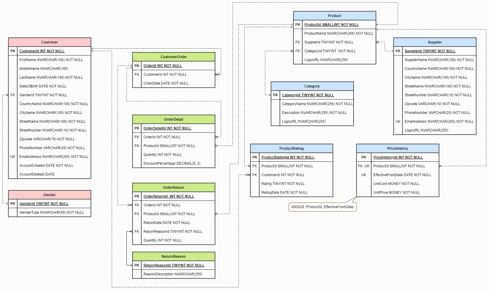
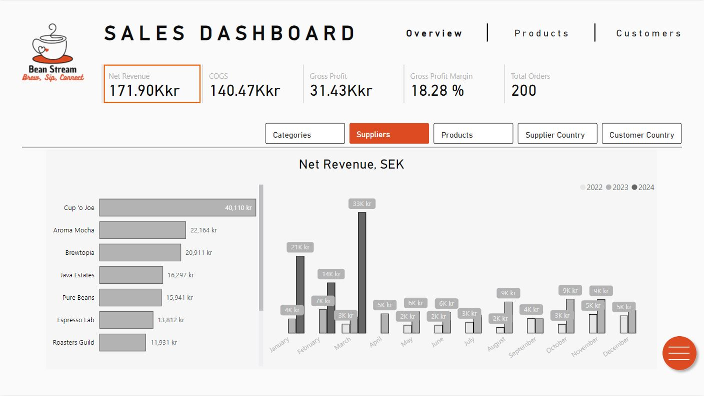
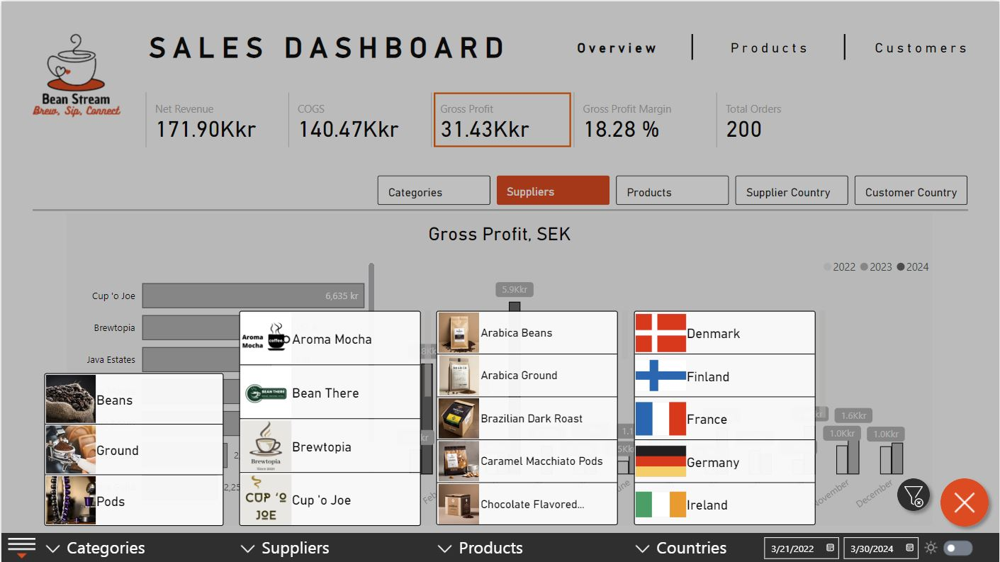
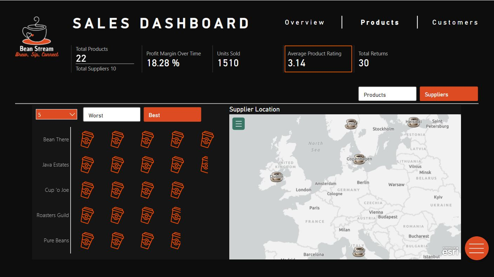

# Brew Insights

## Project Overview
This project involves creating a comprehensive database for the fictional company Bean Stream, populating it with synthetic data, and then utilizing Power BI for data visualization. Bean Stream specializes in selling coffee beans, ground coffee, and coffee pods across Scandinavian countries. The aim is to provide insights into their operations through detailed data analysis and visualization.

## Project Components and Repository Structure
* **Journal** (*Journal.pdf*): A comprehensive journal documenting the thought process and development of the project.
* **ERD Diagram** (*BeanStreamERD.drawio*): An Entity-Relationship Diagram (ERD) created using draw.io to illustrate the database structure.
* **SQL Database** (*BeanStreamDb.sql*): A structured SQL database created in T-SQL for Bean Stream, with tables to manage customers, products, suppliers, orders, and other relevant entities.
* **Power BI Dashboard** (*BeanStreamDashboard.pbix*): A Power BI dashboard for visualizing key business metrics and providing actionable insights.

## Installation and Usage
### Clone the Repository: 
* `git clone https://github.com/Vinaya-Kumar/Database-Modelling-and-Power-BI-Dashboard-for-BeanStream`

### Read the Project journal:
* Open the `Journal.pdf` file to read the detailed daily log documenting the development process.

### Review the ERD Diagram:
* Use draw.io to open and review the `BeanStreamERD.drawio` file to understand the database structure. ERD preview:

### Set Up the SQL Database:
* Use the `BeanStreamDb.sql` script to create and populate the database in your SQL Server instance.

### Open the Power BI Dashboard:
* Open the `BeanStreamDashboard.pbix` file using Power BI Desktop to view and interact with the dashboard. Dashboard preview:

## Disclaimer: 
*BeanStream is a fictional company name used for the purposes of this project. Any resemblance to real companies, existing or formerly existing, is purely coincidental.*
